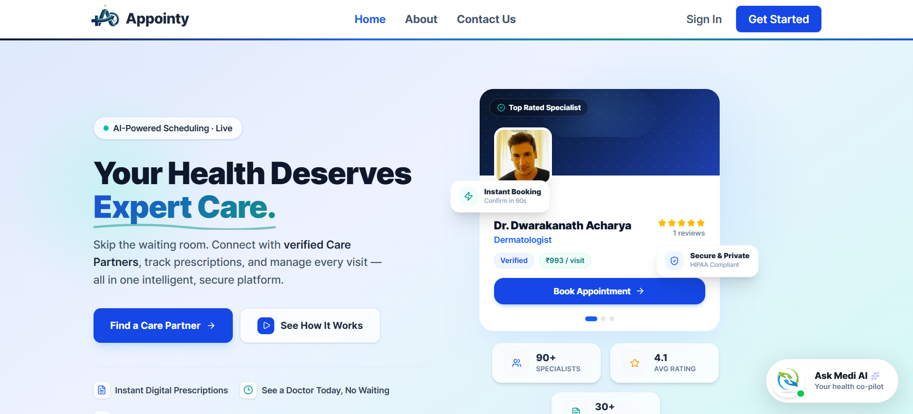
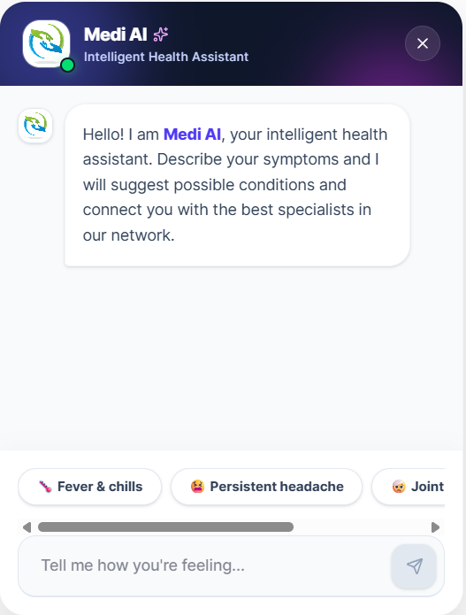
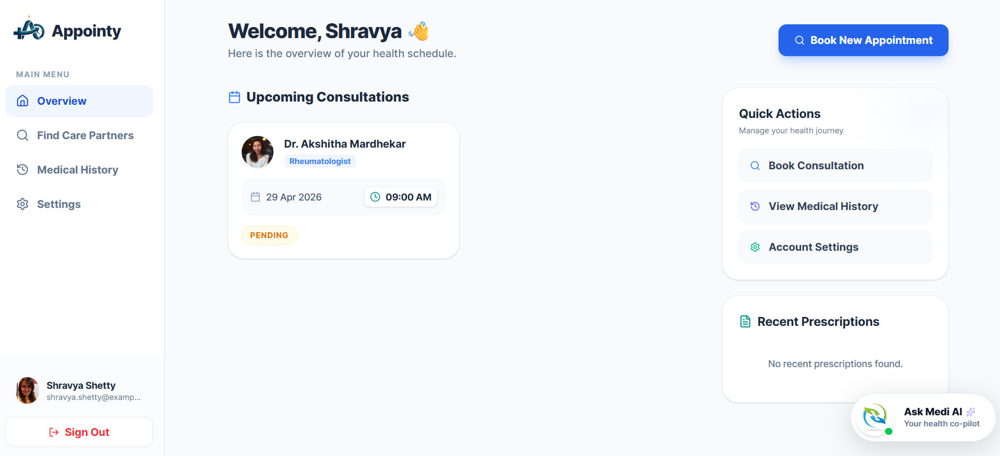
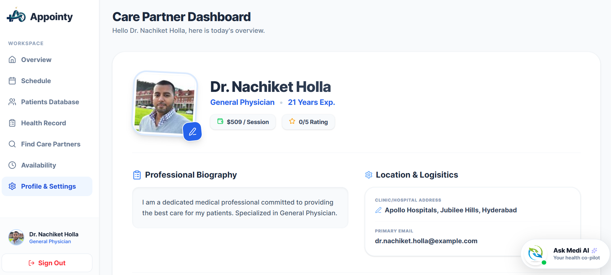
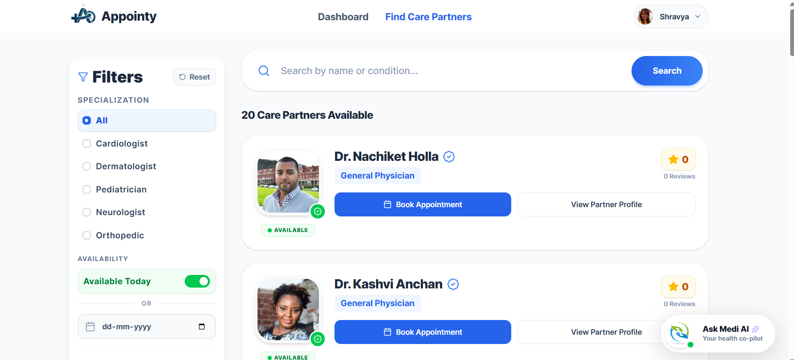

<div align="center">
  

  # Appointy - AI-Powered Healthcare Platform 🏥✨

  **Redefining clinical excellence, one line of code at a time.**

  [](https://reactjs.org/)
  [](https://nodejs.org/)
  [](https://www.mongodb.com/)
  [](https://tailwindcss.com/)
  [](https://stripe.com/)
  [](https://aistudio.google.com/)

</div>

<br />

Welcome to **Appointy**, a premium open-source healthcare platform designed to seamlessly bridge the gap between patients and specialized care providers. Built on the modern MERN stack, Appointy features **Medi AI** (an intelligent symptom-analysis assistant powered by Google Gemini), a sleek animated interface, and robust scheduling mechanisms.

---

## 🚀 Live Demo

- **Frontend (Patient/Doctor App):** [https://appointy-healthcare-platform.vercel.app/](https://appointy-healthcare-platform.vercel.app/)
- **Backend API:** [https://mern-healthcare-platform.onrender.com](https://mern-healthcare-platform.onrender.com)

---

## ✨ Key Features

### 🤖 Medi AI Health Assistant
- **Symptom Triage:** Analyzes natural language symptoms using Google Gemini AI.
- **Smart Recommendations:** Suggests medical conditions and dynamically matches patients with top-rated specialists available in the database.
- **In-Chat Booking:** Seamlessly book appointments directly within the chat interface based on real-time doctor availability.

### 📅 Dynamic Appointments & Scheduling
- **Real-Time Availability:** Doctors can manage their weekly schedules and specific time slots.
- **Frictionless Booking Flow:** Patients can view available dates and select time slots with an intuitive UI.
- **Role-Aware Navigation:** Smart routing ensures patients and providers are seamlessly guided to their respective dashboards.

### 👥 Unified Ecosystem (Patient & Doctor Portals)
- **Patient Dashboard:** Manage past and upcoming appointments, view medical records, and submit reviews for doctors.
- **Doctor Dashboard:** Manage patient queues, approve/manage consultations, and update clinic details.

### 💳 Secure and Efficient Transactions
- **Stripe Integration:** Built-in secure payment gateway for handling consultation fees.
- **JWT + Google OAuth:** Robust authentication supporting traditional email login and modern Google Sign-in.

### 🎨 Stunning UI/UX Design
- **Modern Aesthetics:** Features glassmorphism, high-contrast layouts, smooth `framer-motion` animations, and a polished visual language.
- **100% Responsive:** Flawless experience across desktop, tablet, and mobile devices.

---

## 📸 Screenshots

*(Replace these placeholder images by adding screenshots of your application in the `screenshots` folder)*

| Landing Page | Medi AI Assistant |
| :---: | :---: |
|  |  |

| Patient Dashboard | Doctor Profile & Booking |
| :---: | :---: |
|  |  |  |

---

## 🛠️ Technology Stack

**Frontend Architecture:**
- **Core:** React 18 (Vite build system)
- **Styling:** Tailwind CSS, Framer Motion
- **State Management:** Redux Toolkit
- **Routing:** React Router DOM
- **Icons:** Lucide React

**Backend Infrastructure:**
- **Framework:** Node.js, Express.js
- **Database:** MongoDB (mongoose)
- **Authentication:** JSON Web Tokens (JWT), Google OAuth
- **External Data:** [randomuser.me API](https://randomuser.me/) (for realistic seeding)
- **Payments:** Stripe API
- **AI Intelligence:** `@google/genai` (Gemini Flash 2.5)

---

## ⚙️ Getting Started

Follow these simple steps to run Appointy locally.

### Prerequisites
Make sure you have the following installed:
- [Node.js](https://nodejs.org/) (v16+ recommended)
- [Git](https://git-scm.com/)
- A free [MongoDB Atlas Cluster](https://www.mongodb.com/atlas/database)
- A free [Google AI Studio Key](https://aistudio.google.com/) for Medi AI
- A [Stripe Developer Account](https://stripe.com/) for payment testing

### 1. Clone the Repository
```bash
git clone https://github.com/yourusername/mern-healthcare-platform.git
cd mern-healthcare-platform
```

### 2. Configure Environment Variables
You need to set up `.env` files for both the backend and frontend.

**Backend Setup:**
Create `backend/.env` and add:
```env
NODE_ENV=development
PORT=5000
MONGO_URI=your_mongodb_connection_string
JWT_SECRET=your_super_secret_jwt_key
GEMINI_API_KEY=your_google_ai_key
STRIPE_SECRET_KEY=your_stripe_secret_key
# Optional (If testing notifications)
SMTP_USER=your_email_address
SMTP_PASS=your_email_password
```

**Frontend Setup:**
Create `frontend/.env` and add:
```env
VITE_API_URL=http://localhost:5000
# For Production, set to your Vercel URL
# VITE_API_URL=https://mern-healthcare-platform.vercel.app
```

### 3. Install & Run Dependencies

You will need to run the client and server concurrently. Open two terminal windows.

**Terminal 1: Backend Server**
```bash
cd backend
npm install
npm run dev
```
> Server runs on `http://localhost:5000`

**Terminal 2: Frontend Client**
```bash
cd frontend
npm install
npm run dev
```
> App runs locally on `http://localhost:5173`

---

## 💻 Usage Guide

### Patient Workflow
1. **Sign Up:** Register for a new account either via email or Google OAuth.
2. **Consult Medi AI:** Click the floating Medi AI button in the bottom right corner. Type symptoms (e.g., *"I have a severe rash on my arm"*). 
3. **Book an Appointment:** Follow the intelligent recommendation from the AI or browse the search page to find specialists. Select a date/time from their availability and pay the consultation fee.
4. **Manage Dashboards:** Review upcoming appointments and medical history in the Patient Dashboard.

### Provider Workflow
1. **Doctor Registration:** Navigate to `/doctor/signup` and register your professional profile.
2. **Setup Availability:** Go to your dashboard settings and configure your weekly schedule, consultation fees, and details.
3. **Manage Patients:** View pending and upcoming consultations, track payments, and update appointment statuses directly via the Doctor Portal.

---

## 📂 Project Structure

```text
mern-healthcare-platform/
├── backend/
│   ├── src/
│   │   ├── config/      # Database & Environment setups
│   │   ├── controllers/ # Logic (aiController, doctorController, etc.)
│   │   ├── middleware/  # JWT Auth & Request validation
│   │   ├── models/      # Mongoose Schemas (User, Doctor, Appointment)
│   │   └── routes/      # Express API Router Definitions
│   └── server.js        # Main Entry Point
│
└── frontend/
    ├── src/
    │   ├── assets/      # Static graphics, Logos, and Vectors
    │   ├── components/  # Reusable UI (Chatbot, BookingWidget, NavBar)
    │   ├── pages/       # Distinct App Screens (Login, Landing, Dashboards)
    │   ├── redux/       # Redux State (authSlice)
    │   ├── utils/       # Helpers (api.js global axios config)
    │   └── App.jsx      # Global Router setup
    ├── .env             # Environment configs
    └── vite.config.js   # Vite Configured for Tailwind 4
```

---

## 🤝 Contribution Guidelines

We highly encourage community contributions. Please follow this standard workflow:

1. **Fork** the repository.
2. **Create a Feature Branch:** `git checkout -b feature/amazing-feature`
3. **Commit your Changes:** `git commit -m 'Add some amazing feature'`
4. **Push to the Branch:** `git push origin feature/amazing-feature`
5. **Open a Pull Request** describing your changes.

*Please ensure your code runs locally without errors and follows standard formatting rules before submitting.*

---

## 📄 License

This project is distributed under the **Apache License 2.0**. See the `LICENSE` file for more details.

<p align="center">
  Built with ❤️ by **Tushar Raghuwanshi**
</p>
